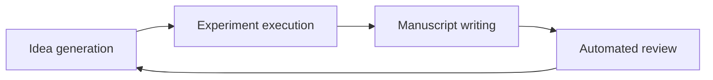

# The AI Scientist: End-to-End Automation Of AI Research

Source note: [Towards End-to-End Automation of AI Research](../../../materials/processed/ai/towards-end-to-end-automation-of-ai-research.md)

Original sources: [Nature article](https://www.nature.com/articles/s41586-026-10265-5), [Sakana AI announcement](https://sakana.ai/ai-scientist-nature/)

## Table Of Contents

1. [Start Here](#start-here)
2. [The Big Idea](#the-big-idea)
3. [What Counts As Research?](#what-counts-as-research)
4. [The Four-Part Loop](#the-four-part-loop)
5. [Step 1: Generate Ideas](#step-1-generate-ideas)
6. [Step 2: Run Experiments](#step-2-run-experiments)
7. [Step 3: Write The Paper](#step-3-write-the-paper)
8. [Step 4: Review The Paper](#step-4-review-the-paper)
9. [Template-Based Vs Template-Free](#template-based-vs-template-free)
10. [The Nature Result](#the-nature-result)
11. [What To Be Careful About](#what-to-be-careful-about)
12. [Medium-Length Version](#medium-length-version)
13. [Full-Length Version](#full-length-version)
14. [Quick Check](#quick-check)

## Start Here

This paper is about a system called the AI Scientist. The name sounds grand, but the useful way to read it is more concrete:

> Can an AI system carry a machine-learning research project through the whole loop, from idea to experiment to paper to review?

That is different from asking whether AI can help with research. We already know it can help write code, summarize papers, draft text, or suggest experiments. The harder question is whether those pieces can be connected into a coherent pipeline.

The answer from this work is: partly, sometimes, and with important limits.

## The Big Idea

The AI Scientist tries to automate the lifecycle of a machine-learning research paper.

It does four things:

1. Proposes research ideas.
2. Writes and runs experiment code.
3. Turns the results into a paper.
4. Reviews the paper with an automated reviewer.

That is the whole system in one line.

```text
idea -> experiment -> paper -> review
```

The key shift is that the agent is not just producing a paragraph or a code snippet. It is trying to create a complete research artifact: a paper backed by experiments.

## What Counts As Research?

Before reading the result, slow down on the word "research."

In machine learning, a small research project usually has several moving parts:

- A question: What are we trying to understand or improve?
- A hypothesis: What do we think will happen?
- A method: What algorithm, model, dataset, or experiment will test it?
- Evidence: What results came out?
- Interpretation: What do those results mean?
- Communication: How do we explain the work in a paper?
- Review: Would other researchers find it credible?

The AI Scientist tries to touch all of these pieces.

That is why the paper is more interesting than a normal "AI writes papers" headline. The central claim is about connecting the research workflow, not about generating fluent academic prose.

## The Four-Part Loop

Here is the simplest map of the system.



Each stage depends on the previous one.

If the idea is shallow, the experiment may be pointless. If the code is wrong, the results may be meaningless. If the paper overclaims, the review may not catch the real issue. The whole chain is only as strong as its weakest scientific step.

## Step 1: Generate Ideas

The system first proposes research ideas.

A beginner mistake is to imagine this as "make up a cool title." That is too weak. A research idea needs to be testable. It needs to point toward an experiment that can actually be run.

In the template-based version, the system starts with a prepared research setting and code template. It generates candidate ideas, gives them structured descriptions, and checks whether they seem novel using scholarly search tools.

An idea might include:

- A title
- A hypothesis
- A planned experiment
- A judgment of whether it is interesting
- A judgment of whether it is feasible
- A novelty check against existing papers

The novelty check is crucial. If the system simply rediscovers an existing paper, it has not done useful research.

## Step 2: Run Experiments

After choosing an idea, the system edits code and runs experiments.

This is where the research stops being just text. The agent has to create evidence.

In the narrower template-based mode, it starts from a human-provided codebase. That makes the task easier. The system can focus on modifying an existing experiment rather than building an entire research environment from scratch.

In the more open-ended mode, the system has to create more of the experiment itself. It searches through possible branches, tries variants, critiques failures, and decides what to continue.

The paper describes an experimental journal. This is a log of what the system tried and what happened. That journal becomes the memory used later when the system writes the paper.

This journal is a quiet but important part of the design. A research paper is not just the final best number. It is an argument built from a sequence of choices, failures, comparisons, and interpretation.

## Step 3: Write The Paper

Once the system has results, it writes a manuscript.

This is not just polishing. A paper has to make claims in a disciplined way:

- What problem was studied?
- What did the method change?
- What baselines were used?
- What did the experiments show?
- What should the reader not conclude?

The system uses notes, plots, experiment results, and related-work search to fill a LaTeX paper template.

This is also one of the dangerous places. A paper can look professional while still being scientifically weak. It can cite the wrong thing, describe the method unclearly, duplicate figures, overstate the results, or hide failed experiments.

So when reading AI-generated research, the question is not "does this sound academic?" The question is "does the evidence actually support the claim?"

## Step 4: Review The Paper

The system also includes an Automated Reviewer.

This reviewer is meant to imitate part of the conference review process. It produces multiple reviews and a meta-review, using review-style criteria similar to those used in machine-learning conferences.

The Nature paper reports that the Automated Reviewer reaches accept/reject prediction numbers in the same broad range as a human-review agreement baseline used for comparison. That is interesting, but it needs a careful reading.

It does not mean:

- The AI reviewer has deep scientific judgment.
- The AI reviewer can replace expert reviewers.
- The AI reviewer will catch every subtle flaw.

It means:

- On a particular benchmark framing, it can make noisy accept/reject judgments roughly comparable to an already noisy review process.
- It may be useful as one signal in an automated research loop.
- It is not a final authority on scientific truth.

Peer review is a social and technical process. It is not just a classifier.

## Template-Based Vs Template-Free

The paper studies two broad versions of the system.

### Template-Based

The template-based version is like giving the AI a prepared lab bench.

Humans provide a starting code template and a research area. The AI works within that structure.

This makes the system easier to evaluate because the environment is controlled. But it also means the system is less autonomous than the name might suggest.

### Template-Free

The template-free version is more ambitious.

It generates more of the starting setup itself and uses search over experiment branches. It can try different directions, debug failures, critique results, and continue from the most promising branches.

This makes it closer to open-ended research, but also more fragile. More freedom means more chances to drift, make invalid comparisons, or produce experiments that do not answer the original question.

Here is the practical distinction:

```text
template-based: humans narrow the playground, AI explores inside it
template-free: AI helps define more of the playground itself
```

## The Nature Result

The most concrete milestone is the workshop peer-review test.

The authors submitted three AI-generated manuscripts to an ICLR 2025 workshop under an approved protocol and with organizer consent. Reviewers were told that some submissions might be AI-generated, but not which ones.

One of the three received scores of `6`, `7`, and `6`, for an average score of `6.33`. The authors say this would likely have passed the first round of review at that workshop. The submission was withdrawn according to the protocol.

This is important because it moves the discussion from "AI can write paper-like text" to "an AI-generated research artifact can sometimes survive real external review conditions."

But the exact words matter: sometimes, workshop, first round, and likely.

It was not proof that the system can reliably produce top-tier research. It was not a main-conference acceptance. It was not fully independent of human system design and human filtering. It was a milestone showing that the end-to-end loop can sometimes reach a credible threshold.

## What To Be Careful About

This area is exciting, but the failure modes are serious.

### 1. Polished Writing Can Hide Weak Science

A generated paper can look clean while having weak experiments or unsupported claims.

### 2. Review Scores Are Not Truth

Conference review is noisy. Matching some review-prediction metrics does not mean the AI understands the research deeply.

### 3. Human Involvement Still Matters

Humans designed the system, selected evaluation settings, filtered candidates, and controlled the submission protocol.

### 4. Automation Can Flood The Review System

If paper generation becomes cheap, conferences may receive many more plausible-looking submissions. That could make peer review harder, not easier.

### 5. The Work Is Mostly Computational

Machine-learning experiments are unusually automation-friendly because code can run in a contained environment. Other sciences involve physical materials, instruments, safety constraints, and harder-to-automate judgment.

## Medium-Length Version

The AI Scientist is a system for automating the machine-learning research loop. It generates ideas, checks novelty, writes and runs experiments, records results, writes a paper, and reviews that paper with an automated reviewer.

The system has two main settings. In the template-based setting, humans provide a code template and a narrower research area. This makes the system more controlled and easier to evaluate. In the template-free setting, the system has more freedom: it can generate starting code, search across experiment branches, critique outputs, and continue from promising directions.

The headline result is that one AI-generated manuscript passed a first-round peer-review threshold at an ICLR workshop, after being submitted under an approved protocol. This is a real milestone because it tests a complete research artifact against external reviewers. But it is not proof of reliable autonomous science. Only one of three submissions reached that bar, the venue was a workshop rather than the main conference, and the system still has many failure modes.

The most important lesson is that end-to-end research automation is now plausible enough to require serious attention. But scientific quality is not the same as fluent writing, and peer-review plausibility is not the same as truth.

## Full-Length Version

This paper is about moving from AI as a helper to AI as a research-loop operator.

A helper might summarize a paper, write code, or draft an introduction. The AI Scientist tries to string these abilities together into a complete pipeline. It starts with an idea, turns that idea into experiments, converts the experimental results into a manuscript, and then reviews that manuscript.

The system begins with idea generation. A useful idea has to be more than interesting language. It needs a hypothesis and an experimental plan. The system also checks novelty, because rediscovering an existing idea is not useful research.

Then comes experimentation. This is the hard grounding step. The system has to edit code, run experiments, debug errors, collect metrics, and make plots. It keeps an experimental journal so that later stages can understand what happened. That journal is important because a paper should be based on the actual path of evidence, not just a final number.

After the experiments, the system writes a manuscript. It uses the notes, plots, and related-work search to produce a conference-style paper. This is a high-risk stage because academic style can make weak work look stronger than it is. A generated manuscript can be fluent while still having wrong citations, incorrect implementation details, insufficient baselines, or unsupported conclusions.

Finally, the Automated Reviewer evaluates the paper. The reported accept/reject prediction numbers are roughly comparable to a human-review agreement baseline in the authors' setup. That is useful evidence that automated review can act as a signal inside the loop. But it should not be confused with expert certainty. Peer review is noisy, and scientific truth is not the same thing as predicted acceptance.

The Nature publication matters because the authors tested the system in a real peer-review setting. They submitted three generated manuscripts to an ICLR workshop under an approved protocol. One submission received scores that would likely have cleared the first round, and it was then withdrawn as planned.

The sober interpretation is: an AI system can now sometimes generate a complete ML research artifact that external reviewers treat as plausible workshop work. The stronger interpretation, that AI can now reliably do autonomous high-quality science, is not supported.

The most useful mental model is a chain:

```text
idea quality -> code correctness -> experiment validity -> result interpretation -> paper honesty -> review reliability
```

Every link has to hold. The current system shows that the chain can sometimes hold long enough to produce plausible research. It also shows how many places the chain can break.

## Quick Check

Try answering these without looking back.

1. What are the four main stages of the AI Scientist loop?
2. Why is the template-based version less autonomous but easier to control?
3. Why does the template-free version use search over experiment branches?
4. What did the ICLR workshop submission test actually show?
5. Why is "passed peer review" too strong a summary of the result?
6. Name two ways a generated paper could look good but still be scientifically weak.
7. What governance problem appears if AI-generated papers become very cheap?

## One-Minute Summary

The AI Scientist is an end-to-end research automation system for machine-learning papers. It proposes ideas, runs experiments, writes manuscripts, and reviews them. Its most important result is that one generated manuscript likely passed a first-round workshop review threshold under a controlled protocol. That is a milestone for autonomous research agents, but it is not proof that AI can reliably produce top-tier science. The right takeaway is cautious: the research loop is becoming automatable, but scientific rigor, evaluation, disclosure, and governance are now the central problems.
